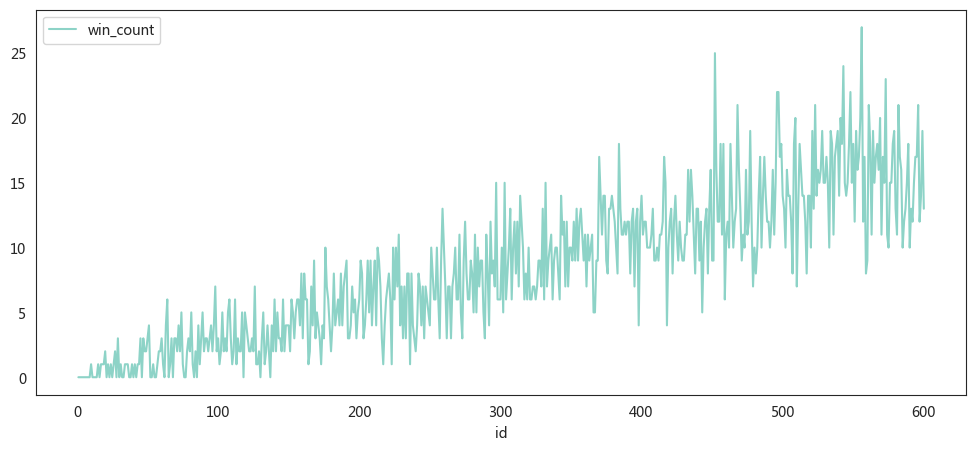

要模拟一个情景，其中有600个人站成一排，每次随机杀掉一个奇数位置的人，目的是找出哪个位置的人最安全。具体实现可以分为以下几个步骤和解释：

### 1. 问题理解

- **初始状态**：有600个人站成一排，编号从1到600。
- **杀人规则**：每一轮中，随机选择当前存活的奇数编号的人，杀掉他们。
- **最终目标**：运行多次模拟，统计每个人被杀的轮次，找出哪些编号的人最晚被杀，或者可能存活到最后。

### 2. 实现思路

实现的关键在于通过多次模拟，记录每个编号的人在每次模拟中被杀的轮次，然后通过统计找到最安全的位置。

### 3. 关键步骤解释

1. **`random_kill(n)` 和 `random_kill_list(alive_ids)` 函数**：
   - `random_kill(n)`：在给定范围内随机选择一个奇数位置的人。
   - `random_kill_list(alive_ids)`：从当前存活的人中，选择一个奇数位置的人进行淘汰。

2. **`run_simulation_numpy(num_people)` 函数**：
   - `ids`：表示所有人的编号，从1到600。
   - `status`：表示每个人的生存状态，1表示存活，0表示被淘汰。
   - `killed_turn`：记录每个人被淘汰的回合，初始值为-1表示尚未被淘汰。
   - 每轮循环中，`alive_ids`会筛选出当前存活的编号，然后随机淘汰其中一个奇数编号的人。
   - 淘汰后更新 `status` 和 `killed_turn`，最后将结果存储在一个DataFrame中。

3. **多次模拟**：
   - 通过循环运行 `run_simulation_numpy(num_people)` N次（例如20000次），在每次模拟中记录每个人的淘汰回合。
   - 结果存储在 `df_simul` DataFrame中，每一列表示一次模拟的结果。


```python
import pandas as pd
import numpy as np
import random
import warnings
import seaborn as sns
from pylab import mpl, plt

# best font and style settings for notebook
warnings.filterwarnings('ignore')
sns.set_style("white")
mpl.rcParams['font.family'] = '微软雅黑'
warnings.filterwarnings('ignore')

from tqdm import tqdm_notebook


def random_kill(n):
    # 生成一个随机的奇数，范围从0到n-1
    return random.choice([i for i in range(n) if i % 2 == 0])


def random_kill_list(alive_ids):
    n = len(alive_ids)
    return alive_ids[random_kill(n)]


def run_simulation_numpy(num_people):

    # 初始化 NumPy 数组
    ids = np.arange(1, num_people + 1)
    killed_turn = np.full(num_people, -1)  # 初始化淘汰回合
    turn_num = num_people

    for turn in range(turn_num):
        alive_ids = ids[killed_turn == -1]  # 获取当前存活的ID
        if len(alive_ids) == 0:  # 如果没有存活者，提前退出循环
            break

        kill_id = random_kill_list(alive_ids) - 1  # 选择要淘汰的ID

        killed_turn[kill_id] = turn + 1  # 记录淘汰回合

    return killed_turn

#
num_people = 600
N = 5000
df_simul = pd.DataFrame({"id": range(1, 1 + num_people)})
for i in tqdm_notebook(range(N)):
    result_df = run_simulation_numpy(num_people)
    df_simul[f'turn_{i}'] = result_df

```


      0%|          | 0/5000 [00:00<?, ?it/s]


```python
df_simul.min().iloc[:-1].sum()
```


    5000


```python
df_simul.iloc[df_simul.iloc[:,1:].idxmax()]
```


<div>
<style scoped>
    .dataframe tbody tr th:only-of-type {
        vertical-align: middle;
    }

    .dataframe tbody tr th {
        vertical-align: top;
    }

    .dataframe thead th {
        text-align: right;
    }
</style>
<table border="1" class="dataframe">
  <thead>
    <tr style="text-align: right;">
      <th></th>
      <th>id</th>
      <th>turn_0</th>
      <th>turn_1</th>
      <th>turn_2</th>
      <th>turn_3</th>
      <th>turn_4</th>
      <th>turn_5</th>
      <th>turn_6</th>
      <th>turn_7</th>
      <th>turn_8</th>
      <th>...</th>
      <th>turn_4990</th>
      <th>turn_4991</th>
      <th>turn_4992</th>
      <th>turn_4993</th>
      <th>turn_4994</th>
      <th>turn_4995</th>
      <th>turn_4996</th>
      <th>turn_4997</th>
      <th>turn_4998</th>
      <th>turn_4999</th>
    </tr>
  </thead>
  <tbody>
    <tr>
      <th>218</th>
      <td>219</td>
      <td>600</td>
      <td>257</td>
      <td>88</td>
      <td>406</td>
      <td>422</td>
      <td>275</td>
      <td>283</td>
      <td>456</td>
      <td>566</td>
      <td>...</td>
      <td>402</td>
      <td>216</td>
      <td>401</td>
      <td>41</td>
      <td>563</td>
      <td>25</td>
      <td>359</td>
      <td>36</td>
      <td>537</td>
      <td>482</td>
    </tr>
    <tr>
      <th>335</th>
      <td>336</td>
      <td>350</td>
      <td>600</td>
      <td>400</td>
      <td>593</td>
      <td>286</td>
      <td>288</td>
      <td>501</td>
      <td>515</td>
      <td>230</td>
      <td>...</td>
      <td>441</td>
      <td>257</td>
      <td>33</td>
      <td>52</td>
      <td>69</td>
      <td>433</td>
      <td>304</td>
      <td>390</td>
      <td>251</td>
      <td>474</td>
    </tr>
    <tr>
      <th>246</th>
      <td>247</td>
      <td>275</td>
      <td>54</td>
      <td>600</td>
      <td>83</td>
      <td>275</td>
      <td>80</td>
      <td>300</td>
      <td>19</td>
      <td>119</td>
      <td>...</td>
      <td>229</td>
      <td>1</td>
      <td>80</td>
      <td>64</td>
      <td>202</td>
      <td>163</td>
      <td>74</td>
      <td>245</td>
      <td>21</td>
      <td>419</td>
    </tr>
    <tr>
      <th>559</th>
      <td>560</td>
      <td>382</td>
      <td>280</td>
      <td>271</td>
      <td>600</td>
      <td>463</td>
      <td>123</td>
      <td>508</td>
      <td>156</td>
      <td>296</td>
      <td>...</td>
      <td>535</td>
      <td>528</td>
      <td>402</td>
      <td>394</td>
      <td>198</td>
      <td>46</td>
      <td>503</td>
      <td>530</td>
      <td>141</td>
      <td>370</td>
    </tr>
    <tr>
      <th>413</th>
      <td>414</td>
      <td>553</td>
      <td>346</td>
      <td>368</td>
      <td>425</td>
      <td>600</td>
      <td>154</td>
      <td>423</td>
      <td>478</td>
      <td>290</td>
      <td>...</td>
      <td>582</td>
      <td>450</td>
      <td>563</td>
      <td>497</td>
      <td>192</td>
      <td>305</td>
      <td>136</td>
      <td>600</td>
      <td>527</td>
      <td>583</td>
    </tr>
    <tr>
      <th>...</th>
      <td>...</td>
      <td>...</td>
      <td>...</td>
      <td>...</td>
      <td>...</td>
      <td>...</td>
      <td>...</td>
      <td>...</td>
      <td>...</td>
      <td>...</td>
      <td>...</td>
      <td>...</td>
      <td>...</td>
      <td>...</td>
      <td>...</td>
      <td>...</td>
      <td>...</td>
      <td>...</td>
      <td>...</td>
      <td>...</td>
      <td>...</td>
    </tr>
    <tr>
      <th>460</th>
      <td>461</td>
      <td>174</td>
      <td>206</td>
      <td>139</td>
      <td>140</td>
      <td>107</td>
      <td>142</td>
      <td>114</td>
      <td>340</td>
      <td>342</td>
      <td>...</td>
      <td>309</td>
      <td>219</td>
      <td>383</td>
      <td>350</td>
      <td>30</td>
      <td>600</td>
      <td>4</td>
      <td>127</td>
      <td>226</td>
      <td>161</td>
    </tr>
    <tr>
      <th>599</th>
      <td>600</td>
      <td>98</td>
      <td>574</td>
      <td>154</td>
      <td>468</td>
      <td>486</td>
      <td>60</td>
      <td>294</td>
      <td>330</td>
      <td>236</td>
      <td>...</td>
      <td>256</td>
      <td>410</td>
      <td>540</td>
      <td>62</td>
      <td>548</td>
      <td>108</td>
      <td>600</td>
      <td>54</td>
      <td>168</td>
      <td>554</td>
    </tr>
    <tr>
      <th>413</th>
      <td>414</td>
      <td>553</td>
      <td>346</td>
      <td>368</td>
      <td>425</td>
      <td>600</td>
      <td>154</td>
      <td>423</td>
      <td>478</td>
      <td>290</td>
      <td>...</td>
      <td>582</td>
      <td>450</td>
      <td>563</td>
      <td>497</td>
      <td>192</td>
      <td>305</td>
      <td>136</td>
      <td>600</td>
      <td>527</td>
      <td>583</td>
    </tr>
    <tr>
      <th>389</th>
      <td>390</td>
      <td>272</td>
      <td>353</td>
      <td>342</td>
      <td>463</td>
      <td>117</td>
      <td>91</td>
      <td>563</td>
      <td>147</td>
      <td>405</td>
      <td>...</td>
      <td>116</td>
      <td>46</td>
      <td>385</td>
      <td>427</td>
      <td>224</td>
      <td>70</td>
      <td>97</td>
      <td>373</td>
      <td>600</td>
      <td>466</td>
    </tr>
    <tr>
      <th>484</th>
      <td>485</td>
      <td>313</td>
      <td>127</td>
      <td>98</td>
      <td>387</td>
      <td>573</td>
      <td>129</td>
      <td>71</td>
      <td>42</td>
      <td>451</td>
      <td>...</td>
      <td>122</td>
      <td>513</td>
      <td>144</td>
      <td>504</td>
      <td>210</td>
      <td>355</td>
      <td>154</td>
      <td>578</td>
      <td>190</td>
      <td>600</td>
    </tr>
  </tbody>
</table>
<p>5000 rows × 5001 columns</p>
</div>


```python
last_killed_counts = pd.DataFrame(df_simul.iloc[:, 1:].idxmax().values +
                                  np.array(range(1, 1 +
                                                 num_people))).value_counts()
# last_killed_counts.index = list(range(1, num_people + 1))
# last_killed_counts.index.name = 'id'
# last_killed_counts.reset_index()
last_killed_counts
```


    ---------------------------------------------------------------------------

    ValueError                                Traceback (most recent call last)

    Cell In[221], line 1
    ----> 1 last_killed_counts = pd.DataFrame(df_simul.iloc[:, 1:].idxmax().values +
          2                                   np.array(range(1, 1 +
          3                                                  num_people))).value_counts()
          4 # last_killed_counts.index = list(range(1, num_people + 1))
          5 # last_killed_counts.index.name = 'id'
          6 # last_killed_counts.reset_index()
          7 last_killed_counts


    ValueError: operands could not be broadcast together with shapes (5000,) (600,) 


```python
df_simul.iloc[df_simul.iloc[:, 1:].idxmax()]['id'].values
```


    array([219, 336, 247, ..., 414, 390, 485])


```python

```


```python
a = df_simul.iloc[:, 1:].idxmax().values + 1
b = np.array(range(1, 1 + num_people))
# pd.DataFrame(np.concatenate((a, b))).value_counts().sort_index().values - 1

last_killed_counts = pd.DataFrame({
    'id':
    b,
    'win_count':
    pd.DataFrame(np.concatenate((a, b))).value_counts().sort_index().values - 1
})
last_killed_counts.plot(x='id', y='win_count', figsize=(12, 5))
last_killed_counts
```


<div>
<style scoped>
    .dataframe tbody tr th:only-of-type {
        vertical-align: middle;
    }

    .dataframe tbody tr th {
        vertical-align: top;
    }

    .dataframe thead th {
        text-align: right;
    }
</style>
<table border="1" class="dataframe">
  <thead>
    <tr style="text-align: right;">
      <th></th>
      <th>id</th>
      <th>win_count</th>
    </tr>
  </thead>
  <tbody>
    <tr>
      <th>0</th>
      <td>1</td>
      <td>0</td>
    </tr>
    <tr>
      <th>1</th>
      <td>2</td>
      <td>0</td>
    </tr>
    <tr>
      <th>2</th>
      <td>3</td>
      <td>0</td>
    </tr>
    <tr>
      <th>3</th>
      <td>4</td>
      <td>0</td>
    </tr>
    <tr>
      <th>4</th>
      <td>5</td>
      <td>0</td>
    </tr>
    <tr>
      <th>...</th>
      <td>...</td>
      <td>...</td>
    </tr>
    <tr>
      <th>595</th>
      <td>596</td>
      <td>21</td>
    </tr>
    <tr>
      <th>596</th>
      <td>597</td>
      <td>12</td>
    </tr>
    <tr>
      <th>597</th>
      <td>598</td>
      <td>14</td>
    </tr>
    <tr>
      <th>598</th>
      <td>599</td>
      <td>19</td>
    </tr>
    <tr>
      <th>599</th>
      <td>600</td>
      <td>13</td>
    </tr>
  </tbody>
</table>
<p>600 rows × 2 columns</p>
</div>


    

    


```python
last_killed_counts.sort_values('win_count',ascending=False)
```


<div>
<style scoped>
    .dataframe tbody tr th:only-of-type {
        vertical-align: middle;
    }

    .dataframe tbody tr th {
        vertical-align: top;
    }

    .dataframe thead th {
        text-align: right;
    }
</style>
<table border="1" class="dataframe">
  <thead>
    <tr style="text-align: right;">
      <th></th>
      <th>id</th>
      <th>win_count</th>
    </tr>
  </thead>
  <tbody>
    <tr>
      <th>555</th>
      <td>556</td>
      <td>27</td>
    </tr>
    <tr>
      <th>451</th>
      <td>452</td>
      <td>25</td>
    </tr>
    <tr>
      <th>542</th>
      <td>543</td>
      <td>24</td>
    </tr>
    <tr>
      <th>572</th>
      <td>573</td>
      <td>23</td>
    </tr>
    <tr>
      <th>495</th>
      <td>496</td>
      <td>22</td>
    </tr>
    <tr>
      <th>...</th>
      <td>...</td>
      <td>...</td>
    </tr>
    <tr>
      <th>37</th>
      <td>38</td>
      <td>0</td>
    </tr>
    <tr>
      <th>36</th>
      <td>37</td>
      <td>0</td>
    </tr>
    <tr>
      <th>32</th>
      <td>33</td>
      <td>0</td>
    </tr>
    <tr>
      <th>31</th>
      <td>32</td>
      <td>0</td>
    </tr>
    <tr>
      <th>0</th>
      <td>1</td>
      <td>0</td>
    </tr>
  </tbody>
</table>
<p>600 rows × 2 columns</p>
</div>


```python
df_simul['average_alive_turns'] = df_simul.T.mean()
df_simul[['id', 'average_alive_turns']].sort_values(by='average_alive_turns',
                                                    ascending=False)
```


<div>
<style scoped>
    .dataframe tbody tr th:only-of-type {
        vertical-align: middle;
    }

    .dataframe tbody tr th {
        vertical-align: top;
    }

    .dataframe thead th {
        text-align: right;
    }
</style>
<table border="1" class="dataframe">
  <thead>
    <tr style="text-align: right;">
      <th></th>
      <th>id</th>
      <th>average_alive_turns</th>
    </tr>
  </thead>
  <tbody>
    <tr>
      <th>1</th>
      <td>2</td>
      <td>331.908818</td>
    </tr>
    <tr>
      <th>3</th>
      <td>4</td>
      <td>324.174965</td>
    </tr>
    <tr>
      <th>11</th>
      <td>12</td>
      <td>316.400320</td>
    </tr>
    <tr>
      <th>5</th>
      <td>6</td>
      <td>316.315937</td>
    </tr>
    <tr>
      <th>7</th>
      <td>8</td>
      <td>313.761648</td>
    </tr>
    <tr>
      <th>...</th>
      <td>...</td>
      <td>...</td>
    </tr>
    <tr>
      <th>8</th>
      <td>9</td>
      <td>285.386123</td>
    </tr>
    <tr>
      <th>6</th>
      <td>7</td>
      <td>278.004199</td>
    </tr>
    <tr>
      <th>4</th>
      <td>5</td>
      <td>266.746251</td>
    </tr>
    <tr>
      <th>2</th>
      <td>3</td>
      <td>249.878624</td>
    </tr>
    <tr>
      <th>0</th>
      <td>1</td>
      <td>198.270346</td>
    </tr>
  </tbody>
</table>
<p>600 rows × 2 columns</p>
</div>


```python
df_simul[['id', 'average_alive_turns']].plot(x='id',y='average_alive_turns',figsize=(10,5))
```


    <AxesSubplot:xlabel='id'>


    

    


```python
!jupyter nbconvert --to html random_kill_final.ipynb
```

    [NbConvertApp] Converting notebook random_kill_final.ipynb to html
    [NbConvertApp] Writing 443576 bytes to random_kill_final.html


```python
!jupyter nbconvert --to markdown random_kill_final.ipynb
```
