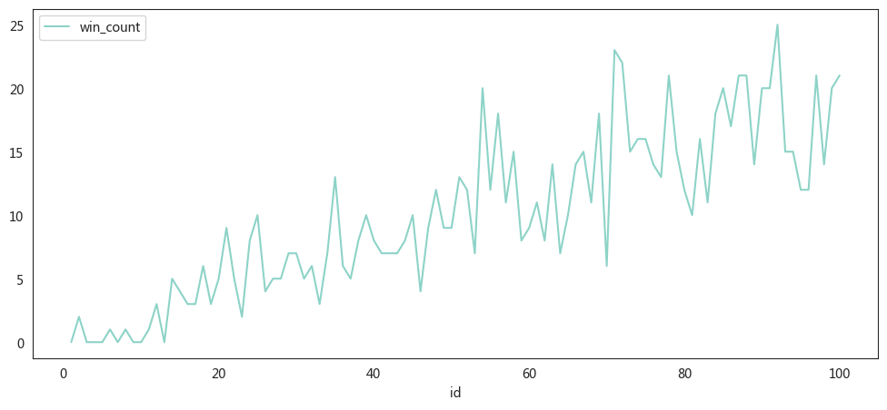

```python
import pandas as pd
import numpy as np
import random
import warnings
import seaborn as sns
from pylab import mpl, plt

# best font and style settings for notebook
warnings.filterwarnings('ignore')
sns.set_style("white")
mpl.rcParams['font.family'] = '微软雅黑'
warnings.filterwarnings('ignore')

from tqdm import tqdm_notebook


def random_kill(n):
    # 生成一个随机的奇数，范围从0到n-1
    return random.choice([i for i in range(n) if i % 2 == 0])


def random_kill_list(alive_ids):
    n = len(alive_ids)
    return alive_ids[random_kill(n)]


def run_simulation_numpy(num_people):

    # 初始化 NumPy 数组
    ids = np.arange(1, num_people + 1)
    status = np.ones(num_people, dtype=int)  # 1表示存活
    killed_turn = np.full(num_people, -1)  # 初始化淘汰回合

    for turn in range(num_people):
        alive_ids = ids[status == 1]  # 获取当前存活的ID
        if len(alive_ids) == 0:  # 如果没有存活者，提前退出循环
            break

        kill_id = random_kill_list(alive_ids) - 1  # 选择要淘汰的ID

        status[kill_id] = 0  # 标记为淘汰
        killed_turn[kill_id] = turn + 1  # 记录淘汰回合

    # 转换为 DataFrame
    df = pd.DataFrame({
        "id": ids,
        "status": status,
        "killed_turn": killed_turn
    })

    return df


#
num_people = 100
df_simul = pd.DataFrame({"id": range(1, 1 + num_people)})
for i in tqdm_notebook(range(1000)):
    result_df = run_simulation_numpy(num_people)
    df_simul[f'turn_{i}'] = result_df['killed_turn']

result_df
```


      0%|          | 0/1000 [00:00<?, ?it/s]


<div>
<style scoped>
    .dataframe tbody tr th:only-of-type {
        vertical-align: middle;
    }

    .dataframe tbody tr th {
        vertical-align: top;
    }

    .dataframe thead th {
        text-align: right;
    }
</style>
<table border="1" class="dataframe">
  <thead>
    <tr style="text-align: right;">
      <th></th>
      <th>id</th>
      <th>status</th>
      <th>killed_turn</th>
    </tr>
  </thead>
  <tbody>
    <tr>
      <th>0</th>
      <td>1</td>
      <td>0</td>
      <td>23</td>
    </tr>
    <tr>
      <th>1</th>
      <td>2</td>
      <td>0</td>
      <td>46</td>
    </tr>
    <tr>
      <th>2</th>
      <td>3</td>
      <td>0</td>
      <td>62</td>
    </tr>
    <tr>
      <th>3</th>
      <td>4</td>
      <td>0</td>
      <td>71</td>
    </tr>
    <tr>
      <th>4</th>
      <td>5</td>
      <td>0</td>
      <td>19</td>
    </tr>
    <tr>
      <th>...</th>
      <td>...</td>
      <td>...</td>
      <td>...</td>
    </tr>
    <tr>
      <th>95</th>
      <td>96</td>
      <td>0</td>
      <td>14</td>
    </tr>
    <tr>
      <th>96</th>
      <td>97</td>
      <td>0</td>
      <td>40</td>
    </tr>
    <tr>
      <th>97</th>
      <td>98</td>
      <td>0</td>
      <td>45</td>
    </tr>
    <tr>
      <th>98</th>
      <td>99</td>
      <td>0</td>
      <td>39</td>
    </tr>
    <tr>
      <th>99</th>
      <td>100</td>
      <td>0</td>
      <td>94</td>
    </tr>
  </tbody>
</table>
<p>100 rows × 3 columns</p>
</div>


```python
df_simul.iloc[df_simul.iloc[:,1:].idxmax()]
```


<div>
<style scoped>
    .dataframe tbody tr th:only-of-type {
        vertical-align: middle;
    }

    .dataframe tbody tr th {
        vertical-align: top;
    }

    .dataframe thead th {
        text-align: right;
    }
</style>
<table border="1" class="dataframe">
  <thead>
    <tr style="text-align: right;">
      <th></th>
      <th>id</th>
      <th>turn_0</th>
      <th>turn_1</th>
      <th>turn_2</th>
      <th>turn_3</th>
      <th>turn_4</th>
      <th>turn_5</th>
      <th>turn_6</th>
      <th>turn_7</th>
      <th>turn_8</th>
      <th>...</th>
      <th>turn_990</th>
      <th>turn_991</th>
      <th>turn_992</th>
      <th>turn_993</th>
      <th>turn_994</th>
      <th>turn_995</th>
      <th>turn_996</th>
      <th>turn_997</th>
      <th>turn_998</th>
      <th>turn_999</th>
    </tr>
  </thead>
  <tbody>
    <tr>
      <th>39</th>
      <td>40</td>
      <td>100</td>
      <td>51</td>
      <td>24</td>
      <td>13</td>
      <td>14</td>
      <td>81</td>
      <td>6</td>
      <td>23</td>
      <td>69</td>
      <td>...</td>
      <td>17</td>
      <td>77</td>
      <td>89</td>
      <td>95</td>
      <td>88</td>
      <td>9</td>
      <td>61</td>
      <td>13</td>
      <td>91</td>
      <td>61</td>
    </tr>
    <tr>
      <th>87</th>
      <td>88</td>
      <td>8</td>
      <td>100</td>
      <td>10</td>
      <td>2</td>
      <td>55</td>
      <td>38</td>
      <td>66</td>
      <td>38</td>
      <td>100</td>
      <td>...</td>
      <td>18</td>
      <td>82</td>
      <td>22</td>
      <td>81</td>
      <td>100</td>
      <td>39</td>
      <td>54</td>
      <td>88</td>
      <td>92</td>
      <td>75</td>
    </tr>
    <tr>
      <th>92</th>
      <td>93</td>
      <td>49</td>
      <td>1</td>
      <td>100</td>
      <td>87</td>
      <td>52</td>
      <td>5</td>
      <td>53</td>
      <td>34</td>
      <td>92</td>
      <td>...</td>
      <td>52</td>
      <td>53</td>
      <td>48</td>
      <td>6</td>
      <td>27</td>
      <td>84</td>
      <td>41</td>
      <td>98</td>
      <td>82</td>
      <td>54</td>
    </tr>
    <tr>
      <th>17</th>
      <td>18</td>
      <td>20</td>
      <td>42</td>
      <td>30</td>
      <td>100</td>
      <td>58</td>
      <td>42</td>
      <td>72</td>
      <td>7</td>
      <td>77</td>
      <td>...</td>
      <td>22</td>
      <td>99</td>
      <td>32</td>
      <td>62</td>
      <td>7</td>
      <td>35</td>
      <td>87</td>
      <td>12</td>
      <td>68</td>
      <td>93</td>
    </tr>
    <tr>
      <th>97</th>
      <td>98</td>
      <td>88</td>
      <td>31</td>
      <td>20</td>
      <td>34</td>
      <td>100</td>
      <td>40</td>
      <td>48</td>
      <td>6</td>
      <td>22</td>
      <td>...</td>
      <td>83</td>
      <td>78</td>
      <td>46</td>
      <td>54</td>
      <td>2</td>
      <td>69</td>
      <td>13</td>
      <td>72</td>
      <td>39</td>
      <td>45</td>
    </tr>
    <tr>
      <th>...</th>
      <td>...</td>
      <td>...</td>
      <td>...</td>
      <td>...</td>
      <td>...</td>
      <td>...</td>
      <td>...</td>
      <td>...</td>
      <td>...</td>
      <td>...</td>
      <td>...</td>
      <td>...</td>
      <td>...</td>
      <td>...</td>
      <td>...</td>
      <td>...</td>
      <td>...</td>
      <td>...</td>
      <td>...</td>
      <td>...</td>
      <td>...</td>
    </tr>
    <tr>
      <th>46</th>
      <td>47</td>
      <td>17</td>
      <td>68</td>
      <td>39</td>
      <td>67</td>
      <td>8</td>
      <td>10</td>
      <td>82</td>
      <td>45</td>
      <td>24</td>
      <td>...</td>
      <td>72</td>
      <td>25</td>
      <td>73</td>
      <td>65</td>
      <td>52</td>
      <td>100</td>
      <td>35</td>
      <td>22</td>
      <td>95</td>
      <td>49</td>
    </tr>
    <tr>
      <th>94</th>
      <td>95</td>
      <td>22</td>
      <td>28</td>
      <td>77</td>
      <td>30</td>
      <td>50</td>
      <td>58</td>
      <td>61</td>
      <td>47</td>
      <td>44</td>
      <td>...</td>
      <td>85</td>
      <td>76</td>
      <td>42</td>
      <td>10</td>
      <td>26</td>
      <td>83</td>
      <td>100</td>
      <td>7</td>
      <td>72</td>
      <td>81</td>
    </tr>
    <tr>
      <th>90</th>
      <td>91</td>
      <td>64</td>
      <td>10</td>
      <td>64</td>
      <td>28</td>
      <td>96</td>
      <td>45</td>
      <td>91</td>
      <td>10</td>
      <td>61</td>
      <td>...</td>
      <td>5</td>
      <td>11</td>
      <td>35</td>
      <td>39</td>
      <td>22</td>
      <td>68</td>
      <td>14</td>
      <td>100</td>
      <td>78</td>
      <td>31</td>
    </tr>
    <tr>
      <th>67</th>
      <td>68</td>
      <td>85</td>
      <td>70</td>
      <td>94</td>
      <td>24</td>
      <td>16</td>
      <td>85</td>
      <td>22</td>
      <td>41</td>
      <td>67</td>
      <td>...</td>
      <td>53</td>
      <td>75</td>
      <td>51</td>
      <td>8</td>
      <td>94</td>
      <td>37</td>
      <td>88</td>
      <td>46</td>
      <td>100</td>
      <td>2</td>
    </tr>
    <tr>
      <th>91</th>
      <td>92</td>
      <td>51</td>
      <td>56</td>
      <td>52</td>
      <td>68</td>
      <td>84</td>
      <td>80</td>
      <td>83</td>
      <td>24</td>
      <td>33</td>
      <td>...</td>
      <td>13</td>
      <td>18</td>
      <td>100</td>
      <td>3</td>
      <td>79</td>
      <td>66</td>
      <td>90</td>
      <td>63</td>
      <td>79</td>
      <td>100</td>
    </tr>
  </tbody>
</table>
<p>1000 rows × 1001 columns</p>
</div>


```python
# 统计每个ID成为最后一个被淘汰的次数
last_killed = df_simul.iloc[:, 1:].idxmax()
last_killed_counts = {}
for i in range(1, len(df_simul )+1):
    last_killed_counts[i] = 0
# print(last_killed_counts.keys())
for i in df_simul.loc[df_simul.iloc[:, 1:].idxmax()]['id']:
    last_killed_counts[i] += 1
last_killed_counts = pd.DataFrame({
    'id': last_killed_counts.keys(),
    'win_count': last_killed_counts.values()
})

last_killed_counts.plot(x='id',y='win_count',figsize=(12,5))
```


    <AxesSubplot:xlabel='id'>


    

    


```python
last_killed_counts.sort_values('win_count',ascending=False)
```


<div>
<style scoped>
    .dataframe tbody tr th:only-of-type {
        vertical-align: middle;
    }

    .dataframe tbody tr th {
        vertical-align: top;
    }

    .dataframe thead th {
        text-align: right;
    }
</style>
<table border="1" class="dataframe">
  <thead>
    <tr style="text-align: right;">
      <th></th>
      <th>id</th>
      <th>win_count</th>
    </tr>
  </thead>
  <tbody>
    <tr>
      <th>91</th>
      <td>92</td>
      <td>25</td>
    </tr>
    <tr>
      <th>70</th>
      <td>71</td>
      <td>23</td>
    </tr>
    <tr>
      <th>71</th>
      <td>72</td>
      <td>22</td>
    </tr>
    <tr>
      <th>99</th>
      <td>100</td>
      <td>21</td>
    </tr>
    <tr>
      <th>87</th>
      <td>88</td>
      <td>21</td>
    </tr>
    <tr>
      <th>...</th>
      <td>...</td>
      <td>...</td>
    </tr>
    <tr>
      <th>6</th>
      <td>7</td>
      <td>0</td>
    </tr>
    <tr>
      <th>4</th>
      <td>5</td>
      <td>0</td>
    </tr>
    <tr>
      <th>3</th>
      <td>4</td>
      <td>0</td>
    </tr>
    <tr>
      <th>2</th>
      <td>3</td>
      <td>0</td>
    </tr>
    <tr>
      <th>0</th>
      <td>1</td>
      <td>0</td>
    </tr>
  </tbody>
</table>
<p>100 rows × 2 columns</p>
</div>


```python
df_simul['average_alive_turns'] = df_simul.T.mean()
df_simul[['id', 'average_alive_turns']].sort_values(by='average_alive_turns',
                                                    ascending=False)
```


<div>
<style scoped>
    .dataframe tbody tr th:only-of-type {
        vertical-align: middle;
    }

    .dataframe tbody tr th {
        vertical-align: top;
    }

    .dataframe thead th {
        text-align: right;
    }
</style>
<table border="1" class="dataframe">
  <thead>
    <tr style="text-align: right;">
      <th></th>
      <th>id</th>
      <th>average_alive_turns</th>
    </tr>
  </thead>
  <tbody>
    <tr>
      <th>1</th>
      <td>2</td>
      <td>57.129870</td>
    </tr>
    <tr>
      <th>3</th>
      <td>4</td>
      <td>54.033966</td>
    </tr>
    <tr>
      <th>9</th>
      <td>10</td>
      <td>53.224775</td>
    </tr>
    <tr>
      <th>11</th>
      <td>12</td>
      <td>53.204795</td>
    </tr>
    <tr>
      <th>7</th>
      <td>8</td>
      <td>52.812188</td>
    </tr>
    <tr>
      <th>...</th>
      <td>...</td>
      <td>...</td>
    </tr>
    <tr>
      <th>10</th>
      <td>11</td>
      <td>47.536464</td>
    </tr>
    <tr>
      <th>8</th>
      <td>9</td>
      <td>46.769231</td>
    </tr>
    <tr>
      <th>4</th>
      <td>5</td>
      <td>43.889111</td>
    </tr>
    <tr>
      <th>2</th>
      <td>3</td>
      <td>42.407592</td>
    </tr>
    <tr>
      <th>0</th>
      <td>1</td>
      <td>34.379620</td>
    </tr>
  </tbody>
</table>
<p>100 rows × 2 columns</p>
</div>


```python
df_simul[['id', 'average_alive_turns']].plot(x='id',y='average_alive_turns',figsize=(12,5))
```


    <AxesSubplot:xlabel='id'>


    

    


```python
!jupyter nbconvert --to markdown random_kill_final.ipynb
```
