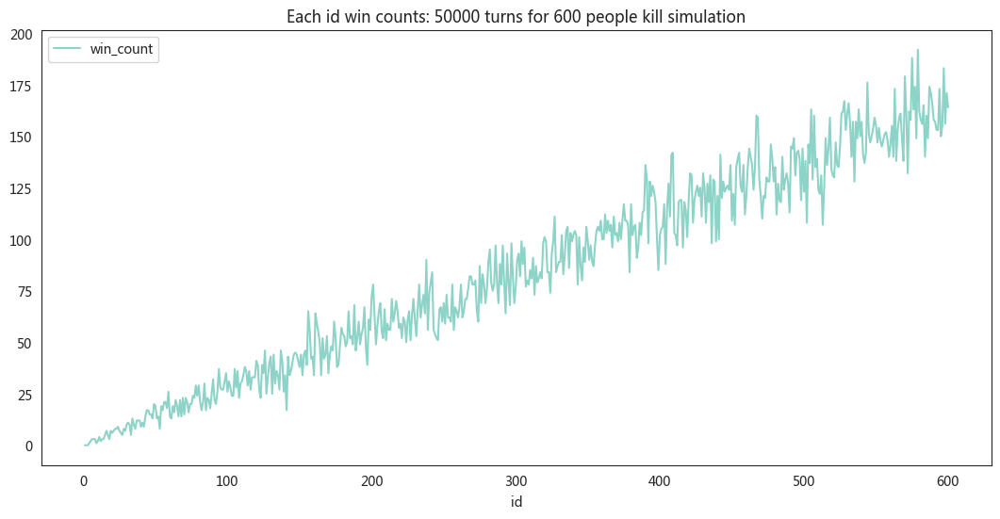

要模拟一个情景，其中有600个人站成一排，每次随机杀掉一个奇数位置的人，目的是找出哪个位置的人最安全。具体实现可以分为以下几个步骤和解释：

### 1. 问题理解

- **初始状态**：有600个人站成一排，编号从1到600。
- **杀人规则**：每一轮中，随机选择当前存活的奇数编号的人，杀掉他们。
- **最终目标**：运行多次模拟，统计每个人被杀的轮次，找出哪些编号的人最晚被杀，或者可能存活到最后。

### 2. 实现思路

实现的关键在于通过多次模拟，记录每个编号的人在每次模拟中被杀的轮次，然后通过统计找到最安全的位置。

### 3. 关键步骤解释

1. **`random_kill(n)` 和 `random_kill_list(alive_ids)` 函数**：
   - `random_kill(n)`：在给定范围内随机选择一个奇数位置的人。
   - `random_kill_list(alive_ids)`：从当前存活的人中，选择一个奇数位置的人进行淘汰。

2. **`run_simulation_numpy(num_people)` 函数**：
   - `ids`：表示所有人的编号，从1到600。
   - `status`：表示每个人的生存状态，1表示存活，0表示被淘汰。
   - `killed_turn`：记录每个人被淘汰的回合，初始值为-1表示尚未被淘汰。
   - 每轮循环中，`alive_ids`会筛选出当前存活的编号，然后随机淘汰其中一个奇数编号的人。
   - 淘汰后更新 `status` 和 `killed_turn`，最后将结果存储在一个DataFrame中。

3. **多次模拟**：
   - 通过循环运行 `run_simulation_numpy(num_people)` N次（例如20000次），在每次模拟中记录每个人的淘汰回合。
   - 结果存储在 `df_simul` DataFrame中，每一列表示一次模拟的结果。


```python
z = 11
k = (z - z % 2) // 2
1 + (z - z % 2) // 2
import random

random.randrange(1, z + 1, 2)
```


    9


```python
import pandas as pd
import numpy as np
import random
import warnings
import seaborn as sns
from pylab import mpl, plt

# best font and style settings for notebook
warnings.filterwarnings('ignore')
sns.set_style("white")
mpl.rcParams['font.family'] = '微软雅黑'
warnings.filterwarnings('ignore')

from tqdm import tqdm_notebook

# def random_kill(n):
#     # 生成一个随机的奇数，范围从0到n-1
#     return random.choice([i for i in range(n) if i % 2 == 0])

# def random_odd(n):
#     return random.randrange(1, n + 1, 2)

# def random_kill_list(alive_ids):
#     n = len(alive_ids)
#     random_odd_idx = random.randrange(1, n + 1, 2)
#     return alive_ids[random_odd_idx - 1]


def run_simulation_numpy(num_people):

    # 初始化 NumPy 数组
    ids = np.arange(1, num_people + 1)
    killed_turn = np.full(num_people, -1)  # 初始化淘汰回合
    turn_num = num_people

    for turn in range(turn_num):
        alive_ids = ids[killed_turn == -1]  # 获取当前存活的ID
        if len(alive_ids) == 0:  # 如果没有存活者，提前退出循环
            break

        random_odd_idx = random.randrange(1, len(alive_ids) + 1, 2)
        kill_id = alive_ids[random_odd_idx - 1] - 1  # 选择要淘汰的ID

        killed_turn[kill_id] = turn + 1  # 记录淘汰回合

    return killed_turn


#
num_people = 600
N = 50000
df_simul = pd.DataFrame({"id": range(1, 1 + num_people)})
for i in tqdm_notebook(range(N)):
    result_df = run_simulation_numpy(num_people)
    df_simul[f'turn_{i}'] = result_df

```


      0%|          | 0/50000 [00:00<?, ?it/s]


```python
# df_simul.to_csv("simul.csv", index=False)
```


```python
# df_simul.min().iloc[:-1].sum()
```


```python
# df_simul.iloc[df_simul.iloc[:,1:].idxmax()]
```


```python
a = df_simul.iloc[:, 1:].idxmax().values + 1
b = np.array(range(1, 1 + num_people))
# pd.DataFrame(np.concatenate((a, b))).value_counts().sort_index().values - 1

last_killed_counts = pd.DataFrame({
    'id':
    b,
    'win_count':
    pd.DataFrame(np.concatenate((a, b))).value_counts().sort_index().values - 1
})
last_killed_counts.plot(x='id',
                        y='win_count',
                        figsize=(13, 6),
                        title=f"Each id win counts: {N} turns for {num_people} people kill simulation")
last_killed_counts
```


<div>
<style scoped>
    .dataframe tbody tr th:only-of-type {
        vertical-align: middle;
    }

    .dataframe tbody tr th {
        vertical-align: top;
    }

    .dataframe thead th {
        text-align: right;
    }
</style>
<table border="1" class="dataframe">
  <thead>
    <tr style="text-align: right;">
      <th></th>
      <th>id</th>
      <th>win_count</th>
    </tr>
  </thead>
  <tbody>
    <tr>
      <th>0</th>
      <td>1</td>
      <td>0</td>
    </tr>
    <tr>
      <th>1</th>
      <td>2</td>
      <td>0</td>
    </tr>
    <tr>
      <th>2</th>
      <td>3</td>
      <td>0</td>
    </tr>
    <tr>
      <th>3</th>
      <td>4</td>
      <td>1</td>
    </tr>
    <tr>
      <th>4</th>
      <td>5</td>
      <td>2</td>
    </tr>
    <tr>
      <th>...</th>
      <td>...</td>
      <td>...</td>
    </tr>
    <tr>
      <th>595</th>
      <td>596</td>
      <td>155</td>
    </tr>
    <tr>
      <th>596</th>
      <td>597</td>
      <td>183</td>
    </tr>
    <tr>
      <th>597</th>
      <td>598</td>
      <td>156</td>
    </tr>
    <tr>
      <th>598</th>
      <td>599</td>
      <td>171</td>
    </tr>
    <tr>
      <th>599</th>
      <td>600</td>
      <td>164</td>
    </tr>
  </tbody>
</table>
<p>600 rows × 2 columns</p>
</div>


    

    


```python
last_killed_counts.sort_values('win_count',ascending=False)
```


<div>
<style scoped>
    .dataframe tbody tr th:only-of-type {
        vertical-align: middle;
    }

    .dataframe tbody tr th {
        vertical-align: top;
    }

    .dataframe thead th {
        text-align: right;
    }
</style>
<table border="1" class="dataframe">
  <thead>
    <tr style="text-align: right;">
      <th></th>
      <th>id</th>
      <th>win_count</th>
    </tr>
  </thead>
  <tbody>
    <tr>
      <th>578</th>
      <td>579</td>
      <td>192</td>
    </tr>
    <tr>
      <th>574</th>
      <td>575</td>
      <td>188</td>
    </tr>
    <tr>
      <th>596</th>
      <td>597</td>
      <td>183</td>
    </tr>
    <tr>
      <th>569</th>
      <td>570</td>
      <td>179</td>
    </tr>
    <tr>
      <th>543</th>
      <td>544</td>
      <td>176</td>
    </tr>
    <tr>
      <th>...</th>
      <td>...</td>
      <td>...</td>
    </tr>
    <tr>
      <th>8</th>
      <td>9</td>
      <td>1</td>
    </tr>
    <tr>
      <th>3</th>
      <td>4</td>
      <td>1</td>
    </tr>
    <tr>
      <th>1</th>
      <td>2</td>
      <td>0</td>
    </tr>
    <tr>
      <th>2</th>
      <td>3</td>
      <td>0</td>
    </tr>
    <tr>
      <th>0</th>
      <td>1</td>
      <td>0</td>
    </tr>
  </tbody>
</table>
<p>600 rows × 2 columns</p>
</div>


```python
df_simul
```


<div>
<style scoped>
    .dataframe tbody tr th:only-of-type {
        vertical-align: middle;
    }

    .dataframe tbody tr th {
        vertical-align: top;
    }

    .dataframe thead th {
        text-align: right;
    }
</style>
<table border="1" class="dataframe">
  <thead>
    <tr style="text-align: right;">
      <th></th>
      <th>id</th>
      <th>turn_0</th>
      <th>turn_1</th>
      <th>turn_2</th>
      <th>turn_3</th>
      <th>turn_4</th>
      <th>turn_5</th>
      <th>turn_6</th>
      <th>turn_7</th>
      <th>turn_8</th>
      <th>...</th>
      <th>turn_49991</th>
      <th>turn_49992</th>
      <th>turn_49993</th>
      <th>turn_49994</th>
      <th>turn_49995</th>
      <th>turn_49996</th>
      <th>turn_49997</th>
      <th>turn_49998</th>
      <th>turn_49999</th>
      <th>average_alive_turns</th>
    </tr>
  </thead>
  <tbody>
    <tr>
      <th>0</th>
      <td>1</td>
      <td>332</td>
      <td>232</td>
      <td>71</td>
      <td>408</td>
      <td>86</td>
      <td>83</td>
      <td>141</td>
      <td>156</td>
      <td>34</td>
      <td>...</td>
      <td>5</td>
      <td>244</td>
      <td>157</td>
      <td>138</td>
      <td>382</td>
      <td>160</td>
      <td>77</td>
      <td>140</td>
      <td>156</td>
      <td>200.390112</td>
    </tr>
    <tr>
      <th>1</th>
      <td>2</td>
      <td>518</td>
      <td>509</td>
      <td>536</td>
      <td>515</td>
      <td>398</td>
      <td>476</td>
      <td>211</td>
      <td>276</td>
      <td>205</td>
      <td>...</td>
      <td>329</td>
      <td>393</td>
      <td>176</td>
      <td>143</td>
      <td>438</td>
      <td>453</td>
      <td>315</td>
      <td>181</td>
      <td>173</td>
      <td>333.847563</td>
    </tr>
    <tr>
      <th>2</th>
      <td>3</td>
      <td>51</td>
      <td>96</td>
      <td>547</td>
      <td>58</td>
      <td>32</td>
      <td>512</td>
      <td>239</td>
      <td>105</td>
      <td>280</td>
      <td>...</td>
      <td>346</td>
      <td>130</td>
      <td>301</td>
      <td>188</td>
      <td>518</td>
      <td>458</td>
      <td>340</td>
      <td>313</td>
      <td>339</td>
      <td>253.819704</td>
    </tr>
    <tr>
      <th>3</th>
      <td>4</td>
      <td>119</td>
      <td>540</td>
      <td>121</td>
      <td>165</td>
      <td>438</td>
      <td>125</td>
      <td>317</td>
      <td>142</td>
      <td>462</td>
      <td>...</td>
      <td>64</td>
      <td>137</td>
      <td>328</td>
      <td>259</td>
      <td>406</td>
      <td>474</td>
      <td>357</td>
      <td>337</td>
      <td>442</td>
      <td>323.595568</td>
    </tr>
    <tr>
      <th>4</th>
      <td>5</td>
      <td>176</td>
      <td>384</td>
      <td>337</td>
      <td>547</td>
      <td>325</td>
      <td>539</td>
      <td>379</td>
      <td>61</td>
      <td>575</td>
      <td>...</td>
      <td>387</td>
      <td>492</td>
      <td>113</td>
      <td>25</td>
      <td>270</td>
      <td>64</td>
      <td>483</td>
      <td>218</td>
      <td>126</td>
      <td>270.638427</td>
    </tr>
    <tr>
      <th>...</th>
      <td>...</td>
      <td>...</td>
      <td>...</td>
      <td>...</td>
      <td>...</td>
      <td>...</td>
      <td>...</td>
      <td>...</td>
      <td>...</td>
      <td>...</td>
      <td>...</td>
      <td>...</td>
      <td>...</td>
      <td>...</td>
      <td>...</td>
      <td>...</td>
      <td>...</td>
      <td>...</td>
      <td>...</td>
      <td>...</td>
      <td>...</td>
    </tr>
    <tr>
      <th>595</th>
      <td>596</td>
      <td>556</td>
      <td>189</td>
      <td>566</td>
      <td>227</td>
      <td>246</td>
      <td>368</td>
      <td>351</td>
      <td>446</td>
      <td>441</td>
      <td>...</td>
      <td>274</td>
      <td>288</td>
      <td>370</td>
      <td>534</td>
      <td>358</td>
      <td>4</td>
      <td>367</td>
      <td>428</td>
      <td>572</td>
      <td>301.580608</td>
    </tr>
    <tr>
      <th>596</th>
      <td>597</td>
      <td>273</td>
      <td>375</td>
      <td>219</td>
      <td>187</td>
      <td>540</td>
      <td>139</td>
      <td>64</td>
      <td>389</td>
      <td>217</td>
      <td>...</td>
      <td>219</td>
      <td>289</td>
      <td>209</td>
      <td>37</td>
      <td>187</td>
      <td>54</td>
      <td>577</td>
      <td>349</td>
      <td>121</td>
      <td>300.592228</td>
    </tr>
    <tr>
      <th>597</th>
      <td>598</td>
      <td>544</td>
      <td>355</td>
      <td>95</td>
      <td>369</td>
      <td>582</td>
      <td>226</td>
      <td>450</td>
      <td>341</td>
      <td>498</td>
      <td>...</td>
      <td>382</td>
      <td>271</td>
      <td>435</td>
      <td>454</td>
      <td>292</td>
      <td>295</td>
      <td>477</td>
      <td>392</td>
      <td>176</td>
      <td>301.060119</td>
    </tr>
    <tr>
      <th>598</th>
      <td>599</td>
      <td>531</td>
      <td>67</td>
      <td>266</td>
      <td>333</td>
      <td>554</td>
      <td>520</td>
      <td>19</td>
      <td>285</td>
      <td>364</td>
      <td>...</td>
      <td>239</td>
      <td>300</td>
      <td>213</td>
      <td>310</td>
      <td>455</td>
      <td>312</td>
      <td>578</td>
      <td>105</td>
      <td>438</td>
      <td>301.595448</td>
    </tr>
    <tr>
      <th>599</th>
      <td>600</td>
      <td>540</td>
      <td>488</td>
      <td>70</td>
      <td>518</td>
      <td>304</td>
      <td>488</td>
      <td>92</td>
      <td>434</td>
      <td>272</td>
      <td>...</td>
      <td>352</td>
      <td>126</td>
      <td>556</td>
      <td>208</td>
      <td>524</td>
      <td>26</td>
      <td>354</td>
      <td>300</td>
      <td>282</td>
      <td>301.216376</td>
    </tr>
  </tbody>
</table>
<p>600 rows × 50002 columns</p>
</div>


```python
df_simul['average_alive_turns'] = df_simul.iloc[:, 1:].T.mean()
df_simul[['id', 'average_alive_turns']].sort_values(by='average_alive_turns',
                                                    ascending=False)
```


<div>
<style scoped>
    .dataframe tbody tr th:only-of-type {
        vertical-align: middle;
    }

    .dataframe tbody tr th {
        vertical-align: top;
    }

    .dataframe thead th {
        text-align: right;
    }
</style>
<table border="1" class="dataframe">
  <thead>
    <tr style="text-align: right;">
      <th></th>
      <th>id</th>
      <th>average_alive_turns</th>
    </tr>
  </thead>
  <tbody>
    <tr>
      <th>1</th>
      <td>2</td>
      <td>333.847563</td>
    </tr>
    <tr>
      <th>3</th>
      <td>4</td>
      <td>323.595568</td>
    </tr>
    <tr>
      <th>5</th>
      <td>6</td>
      <td>317.463111</td>
    </tr>
    <tr>
      <th>7</th>
      <td>8</td>
      <td>313.799384</td>
    </tr>
    <tr>
      <th>9</th>
      <td>10</td>
      <td>312.460991</td>
    </tr>
    <tr>
      <th>...</th>
      <td>...</td>
      <td>...</td>
    </tr>
    <tr>
      <th>8</th>
      <td>9</td>
      <td>284.113218</td>
    </tr>
    <tr>
      <th>6</th>
      <td>7</td>
      <td>279.048939</td>
    </tr>
    <tr>
      <th>4</th>
      <td>5</td>
      <td>270.638427</td>
    </tr>
    <tr>
      <th>2</th>
      <td>3</td>
      <td>253.819704</td>
    </tr>
    <tr>
      <th>0</th>
      <td>1</td>
      <td>200.390112</td>
    </tr>
  </tbody>
</table>
<p>600 rows × 2 columns</p>
</div>


```python
df_simul[['id', 'average_alive_turns']].plot(
    x='id',
    y='average_alive_turns',
    figsize=(13, 6),
    title=
    f"Each id average survival turns: {N} turns for {num_people} people kill simulation"
)
```


    <AxesSubplot:title={'center':'Each id average survival turns: 50000 turns for 600 people kill simulation'}, xlabel='id'>


    

    


```python
# df_simul.to_csv(f"./result/simul_{N}turns_{num_people}_people.csv",
#                 index=False)
```


```python
!jupyter nbconvert --to html random_kill_final.ipynb
```

    [NbConvertApp] Converting notebook random_kill_final.ipynb to html
    [NbConvertApp] Writing 455311 bytes to random_kill_final.html


```python
!jupyter nbconvert --to markdown random_kill_final.ipynb
```
