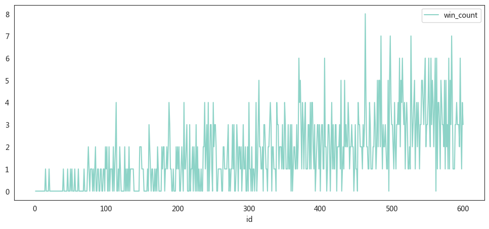
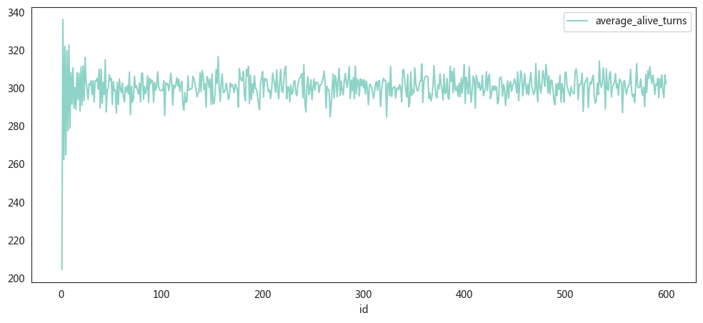

要模拟一个情景，其中有600个人站成一排，每次随机杀掉一个奇数位置的人，目的是找出哪个位置的人最安全。具体实现可以分为以下几个步骤和解释：

### 1. 问题理解

- **初始状态**：有600个人站成一排，编号从1到600。
- **杀人规则**：每一轮中，随机选择当前存活的奇数编号的人，杀掉他们。
- **最终目标**：运行多次模拟，统计每个人被杀的轮次，找出哪些编号的人最晚被杀，或者可能存活到最后。

### 2. 实现思路

实现的关键在于通过多次模拟，记录每个编号的人在每次模拟中被杀的轮次，然后通过统计找到最安全的位置。

### 3. 关键步骤解释

1. **`random_kill(n)` 和 `random_kill_list(alive_ids)` 函数**：
   - `random_kill(n)`：在给定范围内随机选择一个奇数位置的人。
   - `random_kill_list(alive_ids)`：从当前存活的人中，选择一个奇数位置的人进行淘汰。

2. **`run_simulation_numpy(num_people)` 函数**：
   - `ids`：表示所有人的编号，从1到600。
   - `status`：表示每个人的生存状态，1表示存活，0表示被淘汰。
   - `killed_turn`：记录每个人被淘汰的回合，初始值为-1表示尚未被淘汰。
   - 每轮循环中，`alive_ids`会筛选出当前存活的编号，然后随机淘汰其中一个奇数编号的人。
   - 淘汰后更新 `status` 和 `killed_turn`，最后将结果存储在一个DataFrame中。

3. **多次模拟**：
   - 通过循环运行 `run_simulation_numpy(num_people)` N次（例如20000次），在每次模拟中记录每个人的淘汰回合。
   - 结果存储在 `df_simul` DataFrame中，每一列表示一次模拟的结果。


```python
import pandas as pd
import numpy as np
import random
import warnings
import seaborn as sns
from pylab import mpl, plt

# best font and style settings for notebook
warnings.filterwarnings('ignore')
sns.set_style("white")
mpl.rcParams['font.family'] = '微软雅黑'
warnings.filterwarnings('ignore')

from tqdm import tqdm_notebook


def random_kill(n):
    # 生成一个随机的奇数，范围从0到n-1
    return random.choice([i for i in range(n) if i % 2 == 0])


def random_kill_list(alive_ids):
    n = len(alive_ids)
    return alive_ids[random_kill(n)]


def run_simulation_numpy(num_people):

    # 初始化 NumPy 数组
    ids = np.arange(1, num_people + 1)
    status = np.ones(num_people, dtype=int)  # 1表示存活
    killed_turn = np.full(num_people, -1)  # 初始化淘汰回合

    for turn in range(num_people):
        alive_ids = ids[status == 1]  # 获取当前存活的ID
        if len(alive_ids) == 0:  # 如果没有存活者，提前退出循环
            break

        kill_id = random_kill_list(alive_ids) - 1  # 选择要淘汰的ID

        status[kill_id] = 0  # 标记为淘汰
        killed_turn[kill_id] = turn + 1  # 记录淘汰回合

    # 转换为 DataFrame
    df = pd.DataFrame({
        "id": ids,
        "status": status,
        "killed_turn": killed_turn
    })

    return df


#
num_people = 100
N = 10000
df_simul = pd.DataFrame({"id": range(1, 1 + num_people)})
for i in tqdm_notebook(range(N)):
    result_df = run_simulation_numpy(num_people)
    df_simul[f'turn_{i}'] = result_df['killed_turn']

result_df
```


      0%|          | 0/10000 [00:00<?, ?it/s]


<div>
<style scoped>
    .dataframe tbody tr th:only-of-type {
        vertical-align: middle;
    }

    .dataframe tbody tr th {
        vertical-align: top;
    }

    .dataframe thead th {
        text-align: right;
    }
</style>
<table border="1" class="dataframe">
  <thead>
    <tr style="text-align: right;">
      <th></th>
      <th>id</th>
      <th>status</th>
      <th>killed_turn</th>
    </tr>
  </thead>
  <tbody>
    <tr>
      <th>0</th>
      <td>1</td>
      <td>0</td>
      <td>17</td>
    </tr>
    <tr>
      <th>1</th>
      <td>2</td>
      <td>0</td>
      <td>23</td>
    </tr>
    <tr>
      <th>2</th>
      <td>3</td>
      <td>0</td>
      <td>13</td>
    </tr>
    <tr>
      <th>3</th>
      <td>4</td>
      <td>0</td>
      <td>36</td>
    </tr>
    <tr>
      <th>4</th>
      <td>5</td>
      <td>0</td>
      <td>47</td>
    </tr>
    <tr>
      <th>...</th>
      <td>...</td>
      <td>...</td>
      <td>...</td>
    </tr>
    <tr>
      <th>95</th>
      <td>96</td>
      <td>0</td>
      <td>90</td>
    </tr>
    <tr>
      <th>96</th>
      <td>97</td>
      <td>0</td>
      <td>84</td>
    </tr>
    <tr>
      <th>97</th>
      <td>98</td>
      <td>0</td>
      <td>58</td>
    </tr>
    <tr>
      <th>98</th>
      <td>99</td>
      <td>0</td>
      <td>40</td>
    </tr>
    <tr>
      <th>99</th>
      <td>100</td>
      <td>0</td>
      <td>20</td>
    </tr>
  </tbody>
</table>
<p>100 rows × 3 columns</p>
</div>


```python
# df_heatmap = df_simul.iloc[df_simul.iloc[:, 1:].idxmax()]
# sns.heatmap(df_heatmap.iloc[:, 1:].iloc[::1000, ::1000])
```


```python
# >>> df = pd.DataFrame(columns=["City", "Temp (c)", "Rain (mm)", "Wind (m/s)"],
# ...                   data=[["Stockholm", 21.6, 5.0, 3.2],
# ...                         ["Oslo", 22.4, 13.3, 3.1],
# ...                         ["Copenhagen", 24.5, 0.0, 6.7]])
# df.style.background_gradient(

# )
```


```python
df_simul.iloc[df_simul.iloc[:,1:].idxmax()]
```


<div>
<style scoped>
    .dataframe tbody tr th:only-of-type {
        vertical-align: middle;
    }

    .dataframe tbody tr th {
        vertical-align: top;
    }

    .dataframe thead th {
        text-align: right;
    }
</style>
<table border="1" class="dataframe">
  <thead>
    <tr style="text-align: right;">
      <th></th>
      <th>id</th>
      <th>turn_0</th>
      <th>turn_1</th>
      <th>turn_2</th>
      <th>turn_3</th>
      <th>turn_4</th>
      <th>turn_5</th>
      <th>turn_6</th>
      <th>turn_7</th>
      <th>turn_8</th>
      <th>...</th>
      <th>turn_9990</th>
      <th>turn_9991</th>
      <th>turn_9992</th>
      <th>turn_9993</th>
      <th>turn_9994</th>
      <th>turn_9995</th>
      <th>turn_9996</th>
      <th>turn_9997</th>
      <th>turn_9998</th>
      <th>turn_9999</th>
    </tr>
  </thead>
  <tbody>
    <tr>
      <th>77</th>
      <td>78</td>
      <td>100</td>
      <td>70</td>
      <td>66</td>
      <td>48</td>
      <td>94</td>
      <td>36</td>
      <td>52</td>
      <td>93</td>
      <td>58</td>
      <td>...</td>
      <td>82</td>
      <td>26</td>
      <td>83</td>
      <td>78</td>
      <td>74</td>
      <td>98</td>
      <td>52</td>
      <td>84</td>
      <td>4</td>
      <td>72</td>
    </tr>
    <tr>
      <th>74</th>
      <td>75</td>
      <td>38</td>
      <td>100</td>
      <td>64</td>
      <td>31</td>
      <td>30</td>
      <td>66</td>
      <td>87</td>
      <td>66</td>
      <td>9</td>
      <td>...</td>
      <td>98</td>
      <td>12</td>
      <td>60</td>
      <td>7</td>
      <td>38</td>
      <td>73</td>
      <td>1</td>
      <td>1</td>
      <td>55</td>
      <td>45</td>
    </tr>
    <tr>
      <th>96</th>
      <td>97</td>
      <td>58</td>
      <td>40</td>
      <td>100</td>
      <td>41</td>
      <td>92</td>
      <td>60</td>
      <td>92</td>
      <td>32</td>
      <td>24</td>
      <td>...</td>
      <td>79</td>
      <td>49</td>
      <td>32</td>
      <td>17</td>
      <td>96</td>
      <td>1</td>
      <td>36</td>
      <td>78</td>
      <td>56</td>
      <td>84</td>
    </tr>
    <tr>
      <th>78</th>
      <td>79</td>
      <td>94</td>
      <td>66</td>
      <td>92</td>
      <td>100</td>
      <td>73</td>
      <td>49</td>
      <td>7</td>
      <td>65</td>
      <td>16</td>
      <td>...</td>
      <td>45</td>
      <td>19</td>
      <td>58</td>
      <td>73</td>
      <td>86</td>
      <td>41</td>
      <td>41</td>
      <td>19</td>
      <td>76</td>
      <td>8</td>
    </tr>
    <tr>
      <th>42</th>
      <td>43</td>
      <td>1</td>
      <td>45</td>
      <td>87</td>
      <td>22</td>
      <td>100</td>
      <td>64</td>
      <td>33</td>
      <td>12</td>
      <td>57</td>
      <td>...</td>
      <td>36</td>
      <td>76</td>
      <td>99</td>
      <td>19</td>
      <td>83</td>
      <td>28</td>
      <td>96</td>
      <td>71</td>
      <td>34</td>
      <td>96</td>
    </tr>
    <tr>
      <th>...</th>
      <td>...</td>
      <td>...</td>
      <td>...</td>
      <td>...</td>
      <td>...</td>
      <td>...</td>
      <td>...</td>
      <td>...</td>
      <td>...</td>
      <td>...</td>
      <td>...</td>
      <td>...</td>
      <td>...</td>
      <td>...</td>
      <td>...</td>
      <td>...</td>
      <td>...</td>
      <td>...</td>
      <td>...</td>
      <td>...</td>
      <td>...</td>
    </tr>
    <tr>
      <th>95</th>
      <td>96</td>
      <td>64</td>
      <td>85</td>
      <td>7</td>
      <td>37</td>
      <td>2</td>
      <td>39</td>
      <td>11</td>
      <td>7</td>
      <td>13</td>
      <td>...</td>
      <td>39</td>
      <td>32</td>
      <td>41</td>
      <td>22</td>
      <td>25</td>
      <td>100</td>
      <td>21</td>
      <td>86</td>
      <td>66</td>
      <td>90</td>
    </tr>
    <tr>
      <th>61</th>
      <td>62</td>
      <td>62</td>
      <td>30</td>
      <td>22</td>
      <td>5</td>
      <td>85</td>
      <td>84</td>
      <td>89</td>
      <td>100</td>
      <td>85</td>
      <td>...</td>
      <td>35</td>
      <td>56</td>
      <td>38</td>
      <td>92</td>
      <td>84</td>
      <td>25</td>
      <td>100</td>
      <td>98</td>
      <td>77</td>
      <td>22</td>
    </tr>
    <tr>
      <th>48</th>
      <td>49</td>
      <td>76</td>
      <td>33</td>
      <td>54</td>
      <td>87</td>
      <td>18</td>
      <td>38</td>
      <td>50</td>
      <td>74</td>
      <td>71</td>
      <td>...</td>
      <td>57</td>
      <td>96</td>
      <td>84</td>
      <td>6</td>
      <td>78</td>
      <td>59</td>
      <td>28</td>
      <td>100</td>
      <td>99</td>
      <td>1</td>
    </tr>
    <tr>
      <th>59</th>
      <td>60</td>
      <td>88</td>
      <td>67</td>
      <td>50</td>
      <td>44</td>
      <td>76</td>
      <td>98</td>
      <td>46</td>
      <td>24</td>
      <td>75</td>
      <td>...</td>
      <td>54</td>
      <td>67</td>
      <td>55</td>
      <td>39</td>
      <td>13</td>
      <td>68</td>
      <td>74</td>
      <td>50</td>
      <td>100</td>
      <td>5</td>
    </tr>
    <tr>
      <th>38</th>
      <td>39</td>
      <td>63</td>
      <td>19</td>
      <td>60</td>
      <td>79</td>
      <td>33</td>
      <td>82</td>
      <td>64</td>
      <td>31</td>
      <td>55</td>
      <td>...</td>
      <td>60</td>
      <td>11</td>
      <td>96</td>
      <td>34</td>
      <td>59</td>
      <td>57</td>
      <td>46</td>
      <td>16</td>
      <td>84</td>
      <td>100</td>
    </tr>
  </tbody>
</table>
<p>10000 rows × 10001 columns</p>
</div>


```python
# 统计每个ID成为最后一个被淘汰的次数
last_killed = df_simul.iloc[:, 1:].idxmax()
last_killed_counts = {}
for i in range(1, len(df_simul) + 1):
    last_killed_counts[i] = 0
# print(last_killed_counts.keys())
for i in df_simul.loc[df_simul.iloc[:, 1:].idxmax()]['id']:
    last_killed_counts[i] += 1
last_killed_counts = pd.DataFrame({
    'id': last_killed_counts.keys(),
    'win_count': last_killed_counts.values()
})

last_killed_counts.plot(x='id', y='win_count', figsize=(10, 5))
```


    <AxesSubplot:xlabel='id'>


    

    


```python
last_killed_counts.sort_values('win_count',ascending=False)
```


<div>
<style scoped>
    .dataframe tbody tr th:only-of-type {
        vertical-align: middle;
    }

    .dataframe tbody tr th {
        vertical-align: top;
    }

    .dataframe thead th {
        text-align: right;
    }
</style>
<table border="1" class="dataframe">
  <thead>
    <tr style="text-align: right;">
      <th></th>
      <th>id</th>
      <th>win_count</th>
    </tr>
  </thead>
  <tbody>
    <tr>
      <th>94</th>
      <td>95</td>
      <td>207</td>
    </tr>
    <tr>
      <th>97</th>
      <td>98</td>
      <td>203</td>
    </tr>
    <tr>
      <th>95</th>
      <td>96</td>
      <td>201</td>
    </tr>
    <tr>
      <th>99</th>
      <td>100</td>
      <td>200</td>
    </tr>
    <tr>
      <th>96</th>
      <td>97</td>
      <td>193</td>
    </tr>
    <tr>
      <th>...</th>
      <td>...</td>
      <td>...</td>
    </tr>
    <tr>
      <th>3</th>
      <td>4</td>
      <td>9</td>
    </tr>
    <tr>
      <th>5</th>
      <td>6</td>
      <td>7</td>
    </tr>
    <tr>
      <th>2</th>
      <td>3</td>
      <td>3</td>
    </tr>
    <tr>
      <th>1</th>
      <td>2</td>
      <td>3</td>
    </tr>
    <tr>
      <th>0</th>
      <td>1</td>
      <td>0</td>
    </tr>
  </tbody>
</table>
<p>100 rows × 2 columns</p>
</div>


```python
df_simul['average_alive_turns'] = df_simul.T.mean()
df_simul[['id', 'average_alive_turns']].sort_values(by='average_alive_turns',
                                                    ascending=False)
```


<div>
<style scoped>
    .dataframe tbody tr th:only-of-type {
        vertical-align: middle;
    }

    .dataframe tbody tr th {
        vertical-align: top;
    }

    .dataframe thead th {
        text-align: right;
    }
</style>
<table border="1" class="dataframe">
  <thead>
    <tr style="text-align: right;">
      <th></th>
      <th>id</th>
      <th>average_alive_turns</th>
    </tr>
  </thead>
  <tbody>
    <tr>
      <th>1</th>
      <td>2</td>
      <td>56.265373</td>
    </tr>
    <tr>
      <th>3</th>
      <td>4</td>
      <td>54.821618</td>
    </tr>
    <tr>
      <th>5</th>
      <td>6</td>
      <td>54.246975</td>
    </tr>
    <tr>
      <th>9</th>
      <td>10</td>
      <td>53.086491</td>
    </tr>
    <tr>
      <th>7</th>
      <td>8</td>
      <td>52.889311</td>
    </tr>
    <tr>
      <th>...</th>
      <td>...</td>
      <td>...</td>
    </tr>
    <tr>
      <th>8</th>
      <td>9</td>
      <td>47.849215</td>
    </tr>
    <tr>
      <th>6</th>
      <td>7</td>
      <td>46.754225</td>
    </tr>
    <tr>
      <th>4</th>
      <td>5</td>
      <td>45.764524</td>
    </tr>
    <tr>
      <th>2</th>
      <td>3</td>
      <td>42.856214</td>
    </tr>
    <tr>
      <th>0</th>
      <td>1</td>
      <td>33.537446</td>
    </tr>
  </tbody>
</table>
<p>100 rows × 2 columns</p>
</div>


```python
df_simul[['id', 'average_alive_turns']].plot(x='id',y='average_alive_turns',figsize=(10,5))
```


    <AxesSubplot:xlabel='id'>


    

    


```python
!jupyter nbconvert --to html random_kill_final.ipynb
```

    [NbConvertApp] Converting notebook random_kill_final.ipynb to html
    [NbConvertApp] Writing 383929 bytes to random_kill_final.html


```python
!jupyter nbconvert --to markdown random_kill_final.ipynb
```
